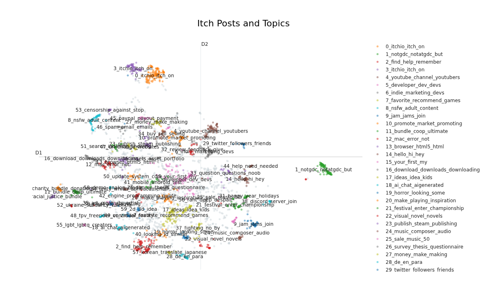
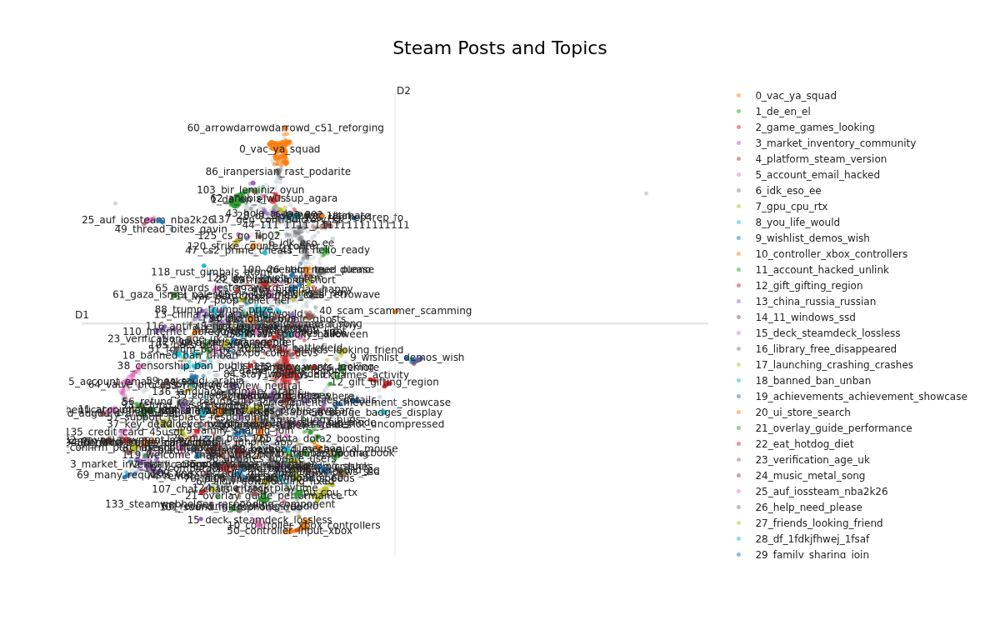

# Web scraping

Forum post titles where scraped from two sources, [Itch.IO General Discussions](https://itch.io/community) and [Steam Community Discussions](https://steamcommunity.com/discussions/) using the programming language F#. In total 2970 different titles where collected from Itch and further 6196 from Steam. Each title then underwent lexical analysis using the [SentenceTransformers (SBERT)](https://sbert.net/) python library.

# Topic Modeling with Bert

The SentenceTransformers (SBERT) library was used to find the semantic similarity between post titles in from each source and group them into overarching topics. SBERT has applications in:
- Semantic search
- Paraphrase mining
- Textual similarity
- Question answering
- Document clustering

In this work we are focused on Paraphrase mining and Document (forum titles) clustering. SBERT works by encoding each sentence into a dense vector representation to capture semantic meaning.
- SBERT contains 10,000 pre-trained models and in this work we made use of the model: `all-MiniLM-L6-v2`.

# Visitation with Plotly

The SBERT library has a self contain Visitation framework which exports a [Plotly](https://plotly.com/python/) interactive graph, where users can isolate and zoom in different topic regions. Static images of these graphs can be found in `./docs/plots/` in this repo.

**Itch IO Topics and Posts**

**Steam Topics and Posts**

## How to Run the interactive graphs

Python and the dependencies in `.venv` are required

1. Clone this repo using git clone
2. In the command line run the python scrip and specify which source you want to graph e.g.: `python nlp.py "steam"` 
3. The interactive graph will open in browser

# Further Research

More forums can be scraped for other sources such as Reddit and further sub-forums from Steam and Itch could also be analysed.

Citations for this research can be found in the docs folder in this repo
